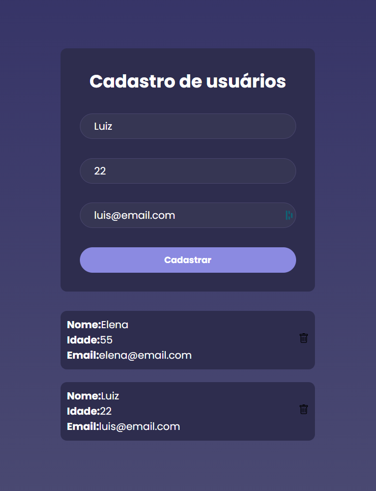

# Cadastro de Clientes

Uma aplicação web moderna para gerenciar o cadastro de clientes com React, Vite e API REST.

## 🎯 Funcionalidades

- ✅ Listar todos os clientes cadastrados
- ✅ Adicionar novos clientes
- ✅ Deletar clientes
- ✅ Interface responsiva e intuitiva
- ✅ Integração com API REST

## 📸 Screenshots



> Adicione a screenshot do projeto funcionando nesta pasta com o nome `screenshot.png`

## 🛠️ Tecnologias Utilizadas

- **React 19** - Biblioteca JavaScript para construir interfaces
- **Vite** - Build tool rápido e moderno
- **Axios** - Cliente HTTP para requisições
- **CSS3** - Estilização
- **Node.js** - Ambiente de execução

## 📦 Instalação

### Pré-requisitos
- Node.js (v22 ou superior)
- npm ou yarn

### Passos

1. Clone o repositório:
```bash
git clone https://github.com/georgevianalima/cadastro-de-clientes.git
cd cadastro-de-clientes
```

2. Instale as dependências:
```bash
npm install
```

3. Inicie o servidor de desenvolvimento:
```bash
npm run dev
```

4. Acesse a aplicação:
```
http://localhost:5173
```

## 📝 Scripts Disponíveis

- `npm run dev` - Inicia o servidor de desenvolvimento com HMR
- `npm run build` - Compila o projeto para produção
- `npm run preview` - Visualiza a build de produção localmente
- `npm run lint` - Executa o linter ESLint

## 🏗️ Estrutura do Projeto

```
cadastro-de-clientes/
├── src/
│   ├── pages/
│   │   └── home/
│   │       ├── index.jsx       # Página principal
│   │       └── style.css        # Estilos
│   ├── services/
│   │   └── api.js              # Configuração da API
│   ├── assets/                 # Imagens e ícones
│   ├── App.jsx                 # Componente raiz
│   ├── main.jsx                # Ponto de entrada
│   └── index.css               # Estilos globais
├── public/                     # Arquivos estáticos
├── index.html                  # HTML principal
├── package.json                # Dependências
└── vite.config.js              # Configuração do Vite
```

## 🔧 Configuração da API

A aplicação se conecta a uma API REST. Configure a URL base da API no arquivo `src/services/api.js`:

```javascript
const api = axios.create({
  baseURL: 'http://localhost:3000' // Ajuste para sua API
})
```

## 📝 Como Usar

1. **Adicionar Cliente:**
   - Preencha os campos (Nome, Idade, Email)
   - Clique no botão "Cadastrar"

2. **Deletar Cliente:**
   - Clique no ícone da lixeira no card do cliente

3. **Visualizar Clientes:**
   - Todos os clientes cadastrados aparecem automaticamente

## 🤝 Contribuindo

Contribuições são bem-vindas! Sinta-se à vontade para abrir issues ou pull requests.

## 📄 Licença

Este projeto está sob a licença MIT.

## 👤 Autor

**George Viana Lima**
- GitHub: [@georgevianalima](https://github.com/georgevianalima)

---

Desenvolvido com ❤️ por George Viana Lima
